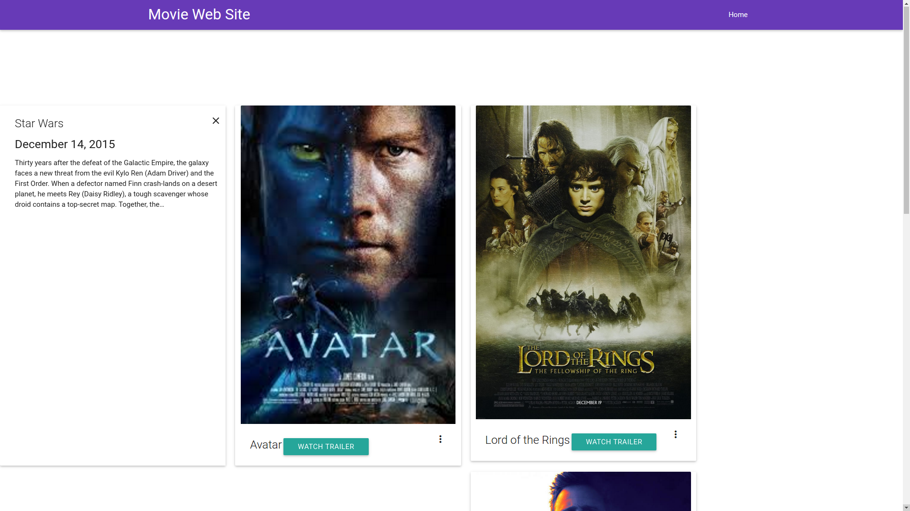

Movie Trailer Web Site
=======

A sample application to show movies

**Installation Instructions**

Install python 
`$ sudo apt-get install python` 
`$ sudo apt-get install nodejs` 
`$ npm install -g bower` 

1. Clone or Download the project

2. `cd` into the project directory,

3. `cd static` go into the static files folder

4. `bower install` to install all the dependencies

5. `cd .. ` to go back to the root folder

6. `cd src/` go into the server files folder

7. `python main.py` to run the server

**Preview**

